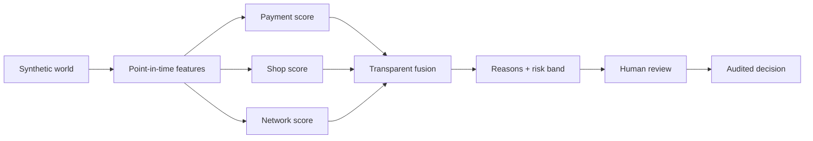

<div align="center">


### Explainable merchant-transaction integrity for Bangla QR

Find the few shops that need review, protect honest merchants, and keep every
decision in human hands.

`Synthetic data only` · `Human-in-the-loop` · `Bangla + English` · `Explainable AI`

[Explore the live dashboard](https://jachai-eta.vercel.app) · [Read the results](reports/summary.md) · [Project report](docs/report.md) · [Three-minute demo](docs/demo_runbook.md)

</div>

> [!IMPORTANT]
> End-to-end synthetic prototype complete. The frozen system has three-seed
> validation and one single-access final synthetic test. Results demonstrate the
> workflow—not real-world accuracy. The dashboard and fast-profile demo API are live.

## At a glance

> **Don’t restrict every merchant; review the few that need context.**

| Problem | Jachai’s response | Evidence boundary | Try it live |
| --- | --- | --- | --- |
| A QR payment can conceal an unlicensed cash-out while honest merchants can look unusual too. | Combines **payment**, **shop** and **payer–shop network** evidence into a review priority and clear reasons. | Synthetic-data prototype only. Rules rank better on the normal synthetic world; Jachai is more robust in the configured non-round evasion check. | [Dashboard](https://jachai-eta.vercel.app) · [Demo API](https://jachai-api.vercel.app) |

Every outcome remains with a human analyst: Jachai recommends review, never
declares guilt or automatically blocks a merchant. The public dashboard serves
cached, code-generated fast-profile demo data; it is a stable demonstration of
the workflow, not a claim of live production model serving.

For the short presentation, follow the [three-minute demo flow](docs/demo_runbook.md#three-minute-live-demo).

## Quick navigation

| Product | Evidence | Responsible AI | Build |
| --- | --- | --- | --- |
| [Features](#2-features) | [Results summary](reports/summary.md) | [Model card](docs/model_card.md) | [Setup](#5-installation-and-setup) |
| [API](#7-run-and-build-commands) | [Final test](reports/final_test.md) | [Data card](docs/data_card.md) | [Commands](#7-run-and-build-commands) |
| [Dashboard](frontend/) | [Three-seed validation](reports/validation_evaluation.md) | [Limitations](docs/limitations.md) | [Testing](#9-testing-instructions) |

## 1. Project overview

For every Bangla QR payment and every shop, Jachai answers one question:
**is this real commerce or a hidden cash-out?** It explains why, and a human
analyst decides what to do.

The problem: a customer "pays" a shop Tk 10,000 by Bangla QR, buys nothing, and
gets about Tk 9,815 back in cash. The shop works as an unlicensed cash-out
point, the customer gets around the Tk 30,000 cash-out limit, and upay loses fee
revenue. Bangladesh Bank requires acquirers to monitor merchants with unusual
patterns. Jachai is a tool for that job.

Our approach: don't limit every shop. Find the few running hidden cash-outs,
protect honest shopkeepers, and turn the leak into new upay agents.

All data is synthetic. Results on synthetic data show that the method works.
They do not prove real-world accuracy.

### How it works



| What Jachai does | What Jachai never does |
| --- | --- |
| Prioritizes shops that need review | Labels a merchant a criminal |
| Shows payment, shop and network evidence | Blocks or restricts automatically |
| Generates polite bilingual explanations | Sends merchant text to an LLM |
| Compares policies on synthetic replay data | Claims production accuracy from synthetic data |

## 2. Features

| Layer | Capability | Why it matters |
| --- | --- | --- |
| **World** | Seeded shops, customers, agents and six misuse patterns | Reproducible development without real PII |
| **Intelligence** | Payment, shop and payer–shop network scores | Different evidence survives different evasions |
| **Explanation** | Top-three reason codes and guarded analyst notes | Analysts see evidence, not a black-box verdict |
| **Operations** | Queue, case timeline, graph and audited decisions | Human control is built into the workflow |
| **Strategy** | Five-policy simulator with configurable assumptions | Makes benefit and merchant-harm trade-offs visible |
| **Trust** | Leakage, fairness, ablation, evasion and final-test reports | Claims stay tied to evidence |

- **Synthetic Bangla QR world** (done): 3,000 shops, 30,000 customers and 600
  agents over 120 days (Jul–Oct 2026), with the 1 Oct regime change. Tables:
  QR payments, remittances, add-money, and P2P transfers (what-if scenario).
  Six misuse patterns and four honest look-alikes are injected by pluggable
  functions listed in `configs/patterns.yaml`. True labels are kept in hidden
  `_true_*` columns for evaluation only; the only observable labels are sparse,
  shop-level past cases (`cases` table) and weak labels from rules.
  Seeded and deterministic. Assumptions: [data/ASSUMPTIONS.md](data/ASSUMPTIONS.md).
  Counts: [reports/world_summary.md](reports/world_summary.md).
- **Point-in-time features** (done): payment, payer and shop features (round
  amounts, amount vs the category's usual basket, near the daily limit, just
  under the Tk 2,000 cap, money paid soon after an inflow, payer–shop distance,
  first visit, shop turnover vs similar shops, ...). Each uses only information
  available at payment time; a cut-off test proves it.
- **Weak labels** (done): one labeling function per misuse pattern plus two
  "honest" ones, combined by a weighted vote behind a replaceable interface.
  Thresholds and weights in `configs/rules.yaml`.
- **Baselines and checks** (done): rules-only and blanket-merchant-limit
  baselines, a single-feature leakage check, and a combined-feature probe.
  Results: [reports/baselines.md](reports/baselines.md),
  [reports/leakage_check.md](reports/leakage_check.md),
  [reports/probe.md](reports/probe.md).

- Payment, shop and payer–shop network scores, fused into low / review / high
  risk bands with top evidence-based reasons (done).
- English analyst case notes and a polite Bangla merchant-notice preview
  (done). Without an API key both use deterministic templates. With
  `LLM_API_KEY`, only the English note may be reworded; a validator rejects
  invented numbers, accusations and promises. Bangla merchant text is never
  sent to the LLM. The notice invites an appeal and does not send or store it;
  a future messaging integration would require analyst approval.
- **Policy simulator** (done): replays one month of a separate replay world (not
  the test set) under five policies: do nothing, blanket merchant limit,
  rules-only review, Jachai-targeted review, and Jachai + convert to agents.
  Reports misuse taka stopped or rerouted, fees recaptured, honest shops
  restricted, alerts per day and agent leads. Parameters in
  `configs/simulator.yaml`, overridable per run.
- **API** (done, FastAPI): `GET /health`, `POST /score/transaction`,
  `GET /shops/{id}`, `GET /cases` (by band, sorted by risk), `GET /cases/{id}`
  (scores, top-3 reasons in English and Bangla, network neighbourhood, 30-day
  timeline, decision history), `POST /cases/{id}/decision` (clear, monitor,
  educate, convert, restrict, escalate; reason required; append-only SQLite audit
  log), `POST /simulate` (slider values), `GET /overview` (dashboard totals), `GET /fairness` (false-alarm rate by
  area type, shop size, category on validation shops), `GET /metrics` (existing
  reports, nothing recomputed). Interactive docs at `/docs`. The API recommends;
  analysts decide; nothing is blocked automatically.
- **Analyst dashboard** (done): responsive workspace with an overview home
  (`GET /overview`: seven-day QR volume with the above-threshold share per day,
  alert bands, ring-linked shops, recent flagged payments, model fingerprint
  and evidence date), alert queue with a shareable `?band=` filter, case detail
  and decision history, merchant-notice preview, interactive five-policy
  simulator, and a trust center for evidence status, fairness and limitations.
  Light-mode blue design system (Inter from `frontend/public/fonts/inter` for
  text and numbers, Agrandir Grand / Clash Display for headlines,
  `frontend/public/logo.svg`); reduced-motion preferences are
  respected. When the API is unavailable the dashboard uses bundled,
  code-generated fast-profile JSON.

## 3. Technology stack

- **ML and data:** Python 3.12+, pandas, NumPy, scikit-learn, LightGBM,
  NetworkX, SHAP
- **Backend:** FastAPI, Pydantic v2
- **Frontend:** Next.js, TypeScript, Tailwind, Recharts
- **Quality:** pytest, ruff, GitHub Actions CI

Every external component and its licence is listed in
[docs/third_party.md](docs/third_party.md).

Evidence and responsible-use documentation:

- [Results summary](reports/summary.md) — status-labelled existing results
- [Data card](docs/data_card.md) — synthetic dataset scope and provenance
- [Model card](docs/model_card.md) — intended use, evidence and oversight
- [Limitations](docs/limitations.md) — claim and deployment boundaries
- [Production plan](docs/production_plan.md) — codebase review findings and the ordered work packages

## 4. Requirements

- Python 3.12 or newer (`python3.12` or `python3.13` on your PATH). NumPy 2.5 and
  SciPy 1.18 need 3.12.
- GNU Make
- Git
- Node.js 20 or newer and npm for the frontend.

## 5. Installation and setup

```bash
git clone <repo-url> jachai
cd jachai
cp .env.example .env
make install
```

`make install` creates `.venv/` and installs the `ml` and `backend` packages in
editable mode with their dev tools.

## 6. Environment variables

Copy `.env.example` to `.env`. Never commit `.env`. All values in
`.env.example` are placeholders.

| Variable | Purpose | Example |
| --- | --- | --- |
| `LLM_PROVIDER` | Optional provider label; currently `openai`. | `openai` |
| `LLM_API_KEY` | Optional OpenAI API key for English analyst-note rewording. Empty = template fallback. | `your-llm-api-key-here` |
| `LLM_MODEL` | OpenAI model used only when `LLM_API_KEY` is set. | `gpt-5-mini` |
| `JACHAI_SEED` | Random seed for the synthetic world. | `42` |
| `JACHAI_DATA_DIR` | Where generated data is written. | `data` |
| `JACHAI_REPORTS_DIR` | Where metrics and figures are written. | `reports` |
| `REPORTS_DIR` | Reports the API serves at `GET /metrics`. | `reports` |
| `AUDIT_DB_PATH` | SQLite file for the append-only decision log. | `data/audit.sqlite3` |
| `ALLOWED_ORIGINS` | Comma-separated origins allowed to call the API (CORS). | `http://localhost:3000` |
| `JACHAI_PROFILE` | Config profile; `fast` = small dev world (see section 10). Empty = reference configs. | *(empty)* |
| `MODEL_DIR` | Where trained models are saved and loaded. | `models` |
| `API_HOST` | Backend bind host. | `127.0.0.1` |
| `API_PORT` | Backend port. | `8000` |
| `NEXT_PUBLIC_API_URL` | Backend URL used by the dashboard. | `http://localhost:8000` |

## 7. Run and build commands

```bash
make help      # list all commands
make install   # create .venv and install packages
make world     # generate synthetic data into data/world, summary into reports/
make train     # train the full system (payment, shop, network, fusion) into models/
make sim       # policy simulator A-E into reports/simulator/ (after make train)
make eval      # baselines, probe, leakage check into reports/ (after make world)
make api       # run the API on :8000 (docs at /docs), reference artifacts
make api-fast  # the API on fast-profile artifacts (after make demo-data)
make web       # run Next.js dashboard on :3000
make test      # ruff + pytest (small in-memory fixtures, under a minute)

# Fast development profile (about 2 minutes or less each)
make world-fast   # small world into data/fast/
make train-fast   # train the system on it into models/fast/
make sim-fast     # policy simulator on the fast world into reports/fast/simulator/
make demo-data    # world-fast + train-fast + sim-fast: data for a local demo

# Long jobs (15-30+ minutes): only when explicitly decided
make validate-full  # multi-seed validation + full ablation into reports/
make eval-final     # ONE-TIME frozen-system test evaluation; refuses overwrite
make format    # auto-fix lint and formatting
make clean     # remove .venv and caches
```

Scenario and seed flags: `make world WORLD_ARGS="--p2p --seed 7"`. `--p2p`
turns on the P2P QR what-if scenario.

`make eval` exits with an error if any single feature predicts the true label
too well on its own (threshold in `configs/thresholds.yaml`).

## 8. Live deployment URL

**Production dashboard:** [https://jachai-eta.vercel.app](https://jachai-eta.vercel.app)

**Public demo API:** [https://jachai-api.vercel.app](https://jachai-api.vercel.app)

The dashboard now calls the public FastAPI service for the generated
fast-profile queue, cases, fairness slices, policy sliders and analyst decision
submissions. It still falls back to bundled synthetic JSON if the API is
unreachable. The serverless API reads cached, code-generated scores rather than
loading LightGBM; its SQLite decision log lives in temporary storage and can
reset between function instances. Use the local API for the complete frozen
model path and durable demo-session behavior.

For a local judge demo, follow [docs/demo_runbook.md](docs/demo_runbook.md).
The submission-ready written report is [docs/report.md](docs/report.md).

## 9. Testing instructions

```bash
make test
```

This runs `ruff check` and `ruff format --check` on the whole repo, then
`pytest` on `ml/tests` and `backend/tests`. The world tests build a small world
in memory: they check that the same seed gives the same world, that every
pattern produces rows that match its description, that true labels are hidden,
and that no value looks like a phone number or NID. GitHub Actions runs the same checks
on every push and pull request (`.github/workflows/ci.yml`).

## 10. Other configuration

### Fast development profile

`JACHAI_PROFILE=fast` (set by every `*-fast` make target) loads
`configs/profiles/fast.yaml` and deep-merges its overrides into the normal
configs before they are validated. It keeps the same code, patterns and hard
negatives but shrinks the world: about 300 shops and 3,000 customers over 30
days (16 Sep to 15 Oct 2026, including the 1 Oct regime change), one seed, with
split dates and model sizes scaled to match. It reads and writes `data/fast/`,
`models/fast/` and `reports/fast/` (gitignored), so it never overwrites the
reference outputs. Use it for every development check; fast-profile numbers are
not results. Reference results come from the normal configs, and multi-seed
validation from `make validate-full`, which is a long job run only on purpose.

The dashboard is light mode only in this phase: blue primary, white cards on a
soft canvas, and the same semantic band colours (success, warning, danger) on
every page. Inter (self-hosted in `frontend/public/fonts/inter`) is the main
UI font. Headlines use Agrandir Grand from `frontend/public/Agrandir` (Pangram
Pangram free weights under the personal licence stored next to them; a commercial
web licence is needed before commercial use), with the bundled Clash Display
webfont in `frontend/public/fonts/clash-display` as the fallback. Amounts are
shown as `৳` with comma grouping.


- Business rules and world settings live in `configs/*.yaml`, never inside
  model code or LLM prompts. `world.yaml` (calendar, regulation, population,
  categories, ...) and `patterns.yaml` (misuse patterns, hard negatives, label
  noise) are filled in and validated when loaded; a typo fails loudly.
  `thresholds.yaml` (feature windows, evaluation warm-up and analyst capacity,
  leakage threshold) and `rules.yaml` (labeling-function thresholds and weights,
  baseline settings) are filled in too.
- Generated data goes to `data/world/` (gitignored): one parquet file per table
  plus `manifest.json` with the seed and a config fingerprint.
- Data assumptions: [data/ASSUMPTIONS.md](data/ASSUMPTIONS.md)
- AI usage log: [docs/ai_usage.md](docs/ai_usage.md)
- Linting and formatting: ruff, configured in `ruff.toml` at the repo root.

### Repository layout

```
configs/        world, patterns, thresholds, rules (YAML)
data/           generated data (gitignored) + ASSUMPTIONS.md
ml/jachai/      world, labels, features, models, explain, simulate, eval
ml/tests/
backend/app/    FastAPI service
backend/tests/
frontend/       Next.js dashboard
reports/        generated metrics, figures, summary.md
docs/           report, data card, model card, third_party.md, ai_usage.md
```
